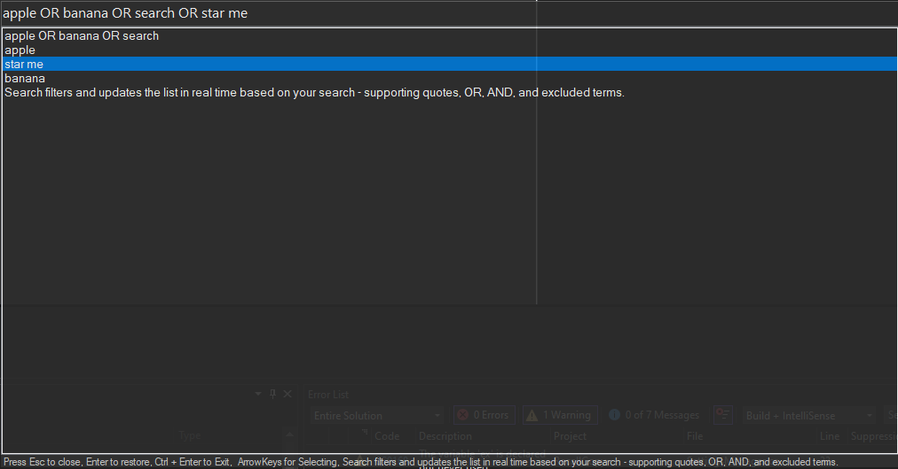

# RecallCopy

By Tamino1230
A simple C# WinForms app that displays a searchable history list with advanced search capabilities.

## Shortcuts:
- Open App: ALT + Q
- Minimise App: ESC / Alt + Q
- Fully Exit: Alt + Enter

## Features
- Real-time filtering as you type  
- Supports `"exact phrases"`, `OR`, `AND`, and `-excluded` terms  
- Prioritizes entries that start with your search  

## Usage
1. Type in the search box to filter history entries.  
2. Use quotes for exact matches, `OR` for alternatives, and `-word` to exclude results.  
   - Example: `c# tutorial OR python -error`

## License
MIT